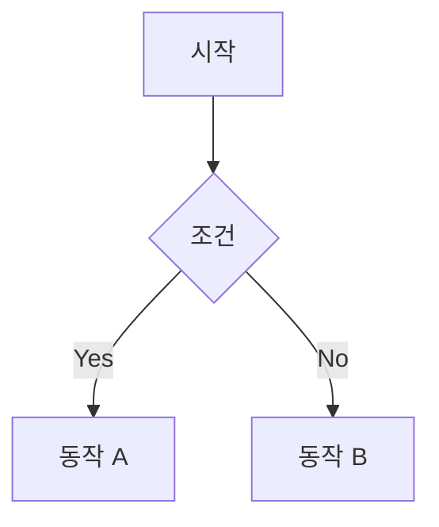

# PR 본문 템플릿

```markdown
## 관련 이슈

- closes #<이슈번호>

> 관련 이슈가 없는 경우: "관련 이슈 없음"

## 요약

<1~3줄로 이 PR이 무엇을 하는지 설명>

## AS-IS (변경 전)

<현재 동작/구조를 설명>
- 구체적인 문제점이나 현재 상태를 기술

## TO-BE (변경 후)

<변경 후 동작/구조를 설명>
- 개선된 점이나 새로운 동작을 기술

## 변경 흐름 (Mermaid)

> 흐름 변경이 있는 경우에만 포함. 단순 스타일 수정, 텍스트 변경 등은 생략.


```
