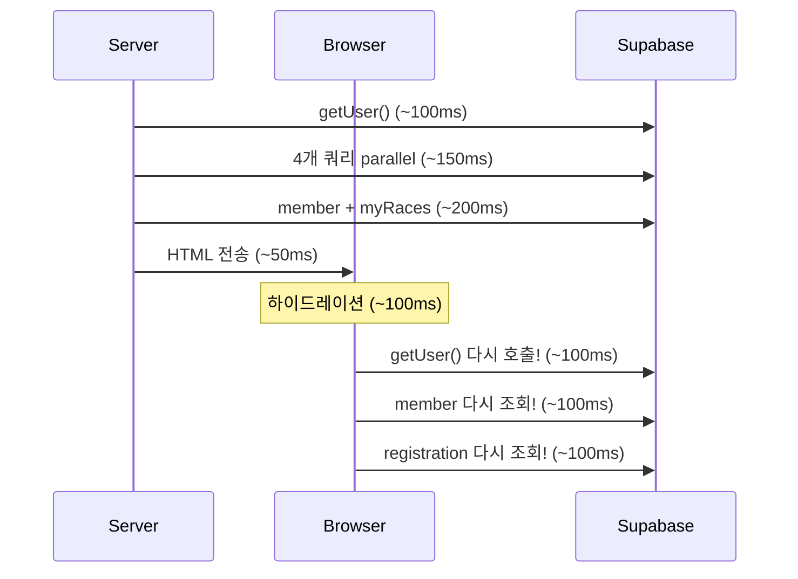

# 성능 병목 분석 및 개선 계획

## 현재 상황 요약

데이터 10개 미만 테이블, 수백 건 이하 데이터인데 **탭 전환 시 1초 이상 걸림**. 원인은 Supabase나 DB 성능이 아니라 **데이터 페칭 구조**에 있음.

---

## 병목 원인 (심각도 순)

### 1. 서버-클라이언트 이중 데이터 페칭 (가장 큰 문제)

서버에서 이미 가져온 데이터를 클라이언트에서 **또 가져오는** 구조가 핵심 병목.

**홈 탭 예시:**




서버에서 이미 user/member/registration을 가져왔는데, [upcoming-races.tsx](components/home/upcoming-races.tsx)가 `"use client"`라서 mount 시 `useEffect`로 **같은 데이터를 다시** 가져옴. [race-list-view.tsx](components/races/race-list-view.tsx)도 동일한 패턴.

- `UpcomingRaces`: useEffect 2개 → `getUser()` + `member` + `competition_registration` 재조회
- `RaceListView`: useEffect 3개 → `getUser()` + `member` + `registration` + `count` 재조회

**영향: 약 300~500ms 추가 지연**

### 2. `supabase.auth.getUser()` 반복 호출

`getUser()`는 매번 **Supabase Auth 서버에 네트워크 요청**을 보냄 (JWT 검증이 아님). 한국에서 Supabase 서버(보통 미국/동남아)까지 왕복하면 **100~200ms**.

현재 호출 횟수:

- Proxy(미들웨어): `getClaims()` (로컬 JWT 검증, 빠름) -- OK
- 홈 페이지 서버: `getUser()` 1회
- `UpcomingRaces` 클라이언트: `getUser()` 1회 (중복!)
- 대회 페이지 `RaceListView` 클라이언트: `getUser()` 1회
- 프로필 서버: `getUser()` 1회

**한 번의 탭 전환에 `getUser()` 2회 = 약 200~400ms 낭비**

### 3. 순차 쿼리 (Sequential Waterfall)

[page.tsx (홈)](app/(main)/page.tsx)에서:

```
getUser() → 완료 대기 → Promise.all(4개) → 완료 대기 → member 조회 → myRaces → regsByComp
```

총 **4단계 순차 실행**. 각 단계가 100~~200ms면 합산 400~~800ms.

### 4. `prefetch={false}` 설정

[bottom-tab-bar.tsx](components/bottom-tab-bar.tsx)에서 탭 링크에 `prefetch={false}` 설정. Next.js의 **자동 프리페치가 꺼져 있어** 탭을 누를 때까지 아무 준비도 안 함.

기본값(`prefetch` 미지정)이면 뷰포트에 보이는 링크를 **미리 로드**해둬서 탭 전환이 거의 즉시 느껴짐.

### 5. `(main)` 라우트에 `loading.tsx` 없음

- `app/(info)/`, `app/(protected)/`, `app/auth/`에는 `loading.tsx`가 있음
- `**app/(main)/`에는 없음** → 탭 전환 시 Next.js 라우트 레벨 로딩 UI가 안 뜸
- 페이지 내 `Suspense` + 스켈레톤은 있지만, 라우트 전환 자체가 서버 데이터 완료까지 블로킹됨

### 6. 홈 페이지 캐싱 없음

- 대회 페이지: `unstable_cache` (24시간 캐시) 사용 → 빠름
- **홈 페이지: 캐싱 없음** → 매 방문마다 5~8개 쿼리 새로 실행

### 7. Supabase 리전 vs Vercel 리전

확인 필요하지만, Supabase 무료 플랜은 보통 **미국(us-east-1)** 리전. Vercel도 기본 **미국(iad1)**. 한국 사용자 기준 왕복 지연 **~200ms/요청**. 쿼리가 여러 번이면 이게 곱해짐.

---

## 개선 방안 (우선순위 순)

### P0: 즉시 효과 (코드 변경 최소)

1. `**prefetch` 활성화** -- `bottom-tab-bar.tsx`에서 `prefetch={false}` 제거. 이것만으로 탭 전환 체감 속도 큰 개선.
2. `**app/(main)/loading.tsx` 추가** -- 탭 전환 시 즉시 스켈레톤 UI 표시. 서버 데이터가 준비되는 동안 빈 화면 대신 로딩 상태 표시.

### P1: 이중 페칭 제거 (핵심 구조 개선)

1. **서버에서 memberStatus/registrations를 props로 전달** -- `UpcomingRaces`, `RaceListView`에서 `useEffect`로 auth/member/registration을 다시 가져오지 않도록, 서버 컴포넌트에서 미리 가져와 props로 넘기기. 클라이언트의 `getUser()` 호출 제거.

### P2: 쿼리 병렬화

1. **홈 페이지 쿼리 재구성** -- `getUser()`를 `Promise.all` 안에 넣어 다른 쿼리와 병렬 실행. 비로그인 경로는 auth 관련 쿼리 스킵.

### P3: 캐싱 적용

1. **홈 페이지 공개 데이터 캐싱** -- 멤버 수, 기강대회 목록, 예정 대회 수, 최근 기록 등은 `unstable_cache` + (필요 시) `revalidateTag`로 캐싱 가능. 이번 범위에서는 홈 공개 데이터에 캐싱을 적용했고, 대회탭은 제외.

### P4: 인프라 (장기)

1. **Supabase 리전 확인** -- 현재 Supabase 프로젝트 리전이 한국/아시아가 아니면, 모든 쿼리에 ~200ms 추가. 무료 플랜 제한이 있지만 확인 필요.

---

## 예상 개선 효과


| 개선 항목          | 예상 절감               |
| -------------- | ------------------- |
| prefetch 활성화   | 탭 전환 체감 ~즉시 (프리로드)  |
| loading.tsx 추가 | 체감 대기 0ms (즉시 스켈레톤) |
| 이중 페칭 제거       | 300~500ms 절감        |
| 쿼리 병렬화         | 200~400ms 절감        |
| 홈 캐싱 적용        | 캐시 히트 시 거의 0ms      |


P0 + P1만 해도 현재 1초+ → **0.3~0.5초** 수준으로 개선 가능.