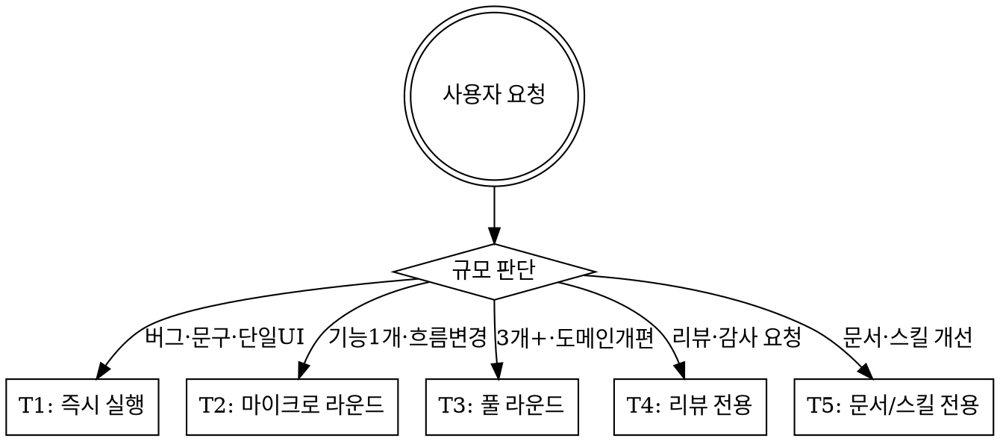

# gigang-dev-loop — 개발 + 문서 + 리뷰 + 자기개선 통합 스킬

> 기강(Gigang) 러닝크루 웹앱을 위한 self-improving 개발 워크플로우.
> 매 실행마다 코드뿐 아니라 SSOT 문서(`CLAUDE.md`, `DESIGN.md`, `.claude/docs/*`)와 스킬 자체가 함께 진화한다.

---

## 발동 조건

기강 프로젝트에서 **모든 개발 관련 요청**에 발동.

| 신호 | 예시 |
|------|------|
| 개발 요청 | "기록 입력 폼 만들어줘", "트레일 랭킹 버그 수정", "프로필 수정 화면" |
| 코드 리뷰 | "이 PR 봐줘", "이 컴포넌트 괜찮아?", "RLS 검토해줘" |
| 문서 개선 | "CLAUDE.md 갱신", "스키마 문서 정리" |
| 리팩토링 | "actions 도메인별로 정리", "thin server 패턴 적용" |
| 전체 개편 | "디자인 시스템 새로", "메인 페이지 리뉴얼" |
| 스킬 개선 | "gigang-dev-loop 업그레이드" |

**발동하지 않는 경우**: 순수 질문(기능 설명, 정책 안내), `/pr` 같은 명시적 슬래시 커맨드의 단독 실행.

---

## 핵심 원칙

1. **매 실행마다 SSOT 문서와 스킬이 함께 개선된다.** 코드만 고치고 끝내지 않는다. Phase F는 절대 생략 불가.
2. **구현 전에 검색·문서 조회.** `node_modules/next/dist/docs/`(Next.js), context7 MCP(라이브러리), Supabase Advisor, WebSearch — 훈련 데이터보다 1차 소스가 우선.
3. **다관점 리뷰는 서비스 관점.** 일반 멤버·운영자·관리자 + 디자이너·엔지니어·보안 = 도메인과 기술 양면.
4. **codex/coderabbit는 세컨드 오피니언.** 정확성·비례성·지속성 3단 필터로 잡음 제거. 채택 기준: "6개월 후에도 가치 있는가?"
5. **서브에이전트는 역할 우선.** `.claude/agents/`에 정의된 테크리드/프론트엔드/백엔드/DevOps에게 작업 위임. ad-hoc 서브에이전트는 모델(haiku/sonnet/opus)을 역할에 맞게 선정.
6. **git 흐름 존중.** `feature/* → dev → main` (squash merge). PR 제목 Conventional Commits. 파괴적 작업 전 확인.
7. **컨벤션 절대 준수.** `lib/dayjs.ts`(날짜), `lib/env.ts`(환경변수), `getCurrentMember()`(멤버 조회), `lib/validations/`(Zod), DESIGN.md 토큰. 우회 금지.

---

## 서브에이전트 / 모델 선정 가이드

### 1순위: `.claude/agents/`에 정의된 도메인 서브에이전트

| 서브에이전트 | 호출 시점 |
|--------------|-----------|
| **테크리드** | 아키텍처 결정, 다파일 리뷰, 도메인 경계 판단, 라운드 종료 판단 |
| **프론트엔드 개발자** | 페이지/컴포넌트 UI, 상태 관리, 데이터 패칭 (React Hook Form, Zod) |
| **백엔드 개발자** | DB 스키마, 마이그레이션, 서버 액션, RLS, Supabase 쿼리, 인증/인가 |
| **DevOps 엔지니어** | CI/CD, Vercel, Supabase 인프라, 환경변수, GitHub Actions |

### 2순위: 모델별 ad-hoc 서브에이전트 (역할 명시 + SSOT 문서 경로 포함)

| 역할 | 모델 | 이유 |
|------|------|------|
| 린트·규칙 검사 (next-best-practices, vercel-react-best-practices 적용) | `haiku` | 규칙 기반, 빠르고 저렴 |
| 단일 파일 코드 리뷰 / 단일 관점 | `sonnet` | 코드 이해력 충분, 속도 우수 |
| 코드베이스 탐색·맵 (Explore) | `sonnet` | 넓은 컨텍스트 처리 |
| DB 스키마 / 데이터 모델 결정 | `opus` | 깊은 추론 + `.claude/docs/database-schema-v2-*` 다문서 교차 |
| 제품/스코프 판단 (CEO 관점) | `opus` | 비즈니스 판단력 |
| 디자인 시스템 / DESIGN.md 토큰 결정 | `sonnet` | 시각 패턴 이해 충분 |
| 보안 (RLS · service role · 시크릿) | `sonnet` | 규칙 + 패턴 매칭 |
| 다관점 종합 / P0 판정 | `opus` | 교차 추론 |
| codex 세컨드 오피니언 | codex CLI | 독립적 제2 시선 |

서브에이전트 호출 시 **description에 역할 명시**, **prompt에 SSOT 문서 경로 포함** (예: `CLAUDE.md`, `DESIGN.md`, `.claude/docs/database-schema-v2.md`).

---

## Phase 구조

모든 실행은 아래 Phase를 따른다. 작업 규모에 따라 Phase B~E를 건너뛰되, **Phase F (필수 후처리)는 절대 생략 불가**.

```
Phase A: 라우팅 (규모 판단)
  ↓
Phase B: 탐색 + 검색 (컨텍스트 확보)
  ↓
Phase C: 실행 (개발 · 리뷰 · 리팩토링)
  ↓
Phase D: 검증 (다관점 리뷰 + codex)
  ↓
Phase E: 보고
  ↓
Phase F: 필수 후처리 (문서개선 + 스킬개선) ← 절대 생략 불가
```

---

### Phase A: 라우팅 — 규모 판단

5트랙 중 하나로 분류한다.



#### T1: 즉시 실행 (30분 이내)
> 버그 수정, 문구 교체, 단일 화면 일부 변경, 한 줄 RLS 보정

- Phase B 최소화 (해당 파일만 Read/Grep)
- Phase C 바로 실행
- Phase D 생략 가능 (변경 < 3파일이고 도메인 격리됨)
- **Phase F 필수**

#### T2: 마이크로 라운드 (1-3시간)
> 새 기능 1개, 흐름 변경, DB 마이그레이션 1개 동반, 라우트 추가

- 도메인 서브에이전트(백엔드/프론트엔드) 위임
- Phase B에서 context7/WebSearch 1-2회
- Phase D 해당 관점 리뷰 1-2종
- **Phase F 필수**

#### T3: 풀 라운드 (4-8시간)
> 3개+ 요청 묶음, 도메인 v2 마이그레이션 같은 대규모 개편, 디자인 시스템 손질

- Phase B 전체 탐색 (Explore 서브에이전트, sonnet)
- Phase C 9단계 워크플로우 (아래 "풀 라운드 상세" 참조)
- Phase D 다관점 4-6종 병렬 QA
- Phase E 구조화된 보고
- **Phase F 필수**

#### T4: 리뷰 전용
> "이 PR 봐줘", "보안 감사", "RLS 점검", "코드 리뷰"

- Phase B 변경 diff 파악 (`git diff origin/dev...HEAD`)
- Phase C 생략
- Phase D 요청된 관점으로 리뷰
- `coderabbit:code-review` 또는 `superpowers:receiving-code-review` 스킬 우선 활용
- **Phase F 필수** (발견사항을 `.claude/docs/` 또는 `CLAUDE.md`의 함정 섹션에 반영)

#### T5: 문서/스킬 전용
> "문서 정리", "스킬 업그레이드", "DESIGN.md 토큰 갱신"

- Phase B 현재 문서 상태 파악
- Phase C 문서/스킬 직접 수정
- 스킬 수정 시 SSOT는 `.skillshare/skills/<name>/`, 수정 후 `skillshare sync` 실행
- Phase D 생략
- **Phase F = Phase C와 동일 (이미 문서 작업)**

---

### Phase B: 탐색 + 검색

#### B1. 코드베이스 탐색

T3(풀 라운드)일 때만 `Agent(subagent_type=Explore, model=sonnet)`로 전체 맵.
그 외 트랙은 해당 파일/디렉토리만 Read/Grep으로 최소 탐색.

탐색 항목 (T3):
- 전체 라우트 ↔ `<Link>` / `router.push` / `redirect()` href 매핑
- 끊긴 링크 후보
- 서버 액션 경계 (`lib/actions/<domain>/`)
- `getCurrentMember()` / `verifyAdmin()` 가드 누락 라우트
- 컴포넌트 중복 (DESIGN.md 컴포넌트 카탈로그와 대조)
- dead code 후보

#### B2. 1차 소스 우선 — 훈련 데이터 신뢰 금지

**매 실행마다 최소 1회** (T1 제외).

| 도구 | 용도 |
|------|------|
| `node_modules/next/dist/docs/` Read | Next.js 공식 문서 (AGENTS.md 규칙) |
| `mcp__plugin_context7_context7__query-docs` | 라이브러리 API 문서 (resolve-library-id → query-docs) |
| `mcp__plugin_supabase_supabase__search_docs` | Supabase 공식 문서 |
| `mcp__supabase-gigang-dev__get_advisors` | RLS/성능 어드바이저 (변경 후 필수 확인) |
| WebSearch | 보안 공지, 경쟁 제품 UX, 최신 베스트 프랙티스 |

검색 키워드 예시:
```
기술: "Next.js 16 app router server actions"
      "Supabase RLS pattern 2026"
      "React 19 useFormState migration"
보안: "Supabase security advisory <year-month>"
UX:   "Korean running app onboarding"
      "마라톤 기록 입력 UX"
```

검색 결과 중 **실제 코드에 영향 있는 것만** 반영. 검색 자체가 목적이 아님.

#### B3. 데이터베이스 스키마 컨텍스트

DB 관련 작업이면 시작 전 필독:
- `.claude/docs/database-schema-v2.md`
- `.claude/docs/database-schema-v2-domains.md`
- 해당 도메인 문서 (예: `database-schema-v2-event-domain.md`, `-title-domain.md`)
- `.claude/docs/database-abbreviation-dictionary.md` (네이밍 컨벤션)
- `.claude/docs/database-schema-v2-rollout-progress.md` (현재 마이그레이션 진행도)

운영 DB는 `mcp__supabase-gigang-prd__*`, 개발은 `-dev`, 로컬은 `-local`. **DDL은 `apply_migration`, DML은 `execute_sql`.**

---

### Phase C: 실행

#### 트랙별 실행

**T1 (즉시)**: 바로 코드 변경. `pnpm run lint` + (필요 시) TS 컴파일 확인.

**T2 (마이크로)**:
1. SSOT 문서 갱신 필요성 판단 (DB 변경 → schema 문서, UI 흐름 변경 → CLAUDE.md/DESIGN.md)
2. 도메인 서브에이전트로 작업 위임 또는 직접 구현
3. `pnpm run lint` + TS 체크
4. next-best-practices / vercel-react-best-practices 스킬을 변경 `.ts`/`.tsx` 파일에 적용

**T3 (풀 라운드)**: 아래 "풀 라운드 상세" 9단계.

**T4 (리뷰)**: Phase D로 직행.

#### 풀 라운드 상세 (T3) — 9단계

| 단계 | 내용 | 주도 | 검토 |
|------|------|------|------|
| 1 | SSOT 문서 갱신 (CLAUDE.md / DESIGN.md / `.claude/docs/*` 영향 영역) | 테크리드 | 백엔드·프론트엔드 |
| 2 | DB 스키마 / 마이그레이션 (`supabase/migrations/`) | 백엔드 | 테크리드 |
| 3 | 서버 액션 / 쿼리 (`lib/actions/<domain>/`, `lib/queries/`) | 백엔드 | 테크리드 |
| 4 | 공통 컴포넌트 / 디자인 토큰 변경 (`components/common/`, `components/ui/`) | 프론트엔드 | 디자이너 관점 |
| 5 | 도메인 페이지 (`app/<route>/page.tsx`) | 프론트엔드 | 테크리드 |
| 6 | Zod 스키마 (`lib/validations/`) + React Hook Form 통합 | 프론트엔드 | 백엔드 |
| 7 | 다관점 병렬 QA (Phase D) | 호출자 | 4-6종 동시 |
| 8 | 관리자 영역 (`app/admin/`, `app/(info)/admin/`) | 백엔드+프론트 | 보안 |
| 9 | 배포/환경변수/PWA 검증 | DevOps | 테크리드 |

각 단계 시작 전 B2 1회, 종료 시 변경된 SSOT 문서 즉시 커밋(작은 단위).

---

### Phase D: 검증 — 다관점 리뷰

#### D1. 서비스 관점 (도메인) — 페르소나 3종

| 페르소나 | 모델 | 관점 / 핵심 질문 |
|----------|------|------------------|
| **일반 멤버** | `sonnet` | "기록 입력이 직관적인가? 대회 정보가 잘 보이는가? 모바일 PWA에서 손맛이 좋은가?" |
| **운영진** | `sonnet` | "대회 등록·기록 검증·공지가 빠른가? 실수 줄어드는 가드 있나?" |
| **관리자(verifyAdmin)** | `sonnet` | "멤버/대회/마일리지 일괄 관리가 효율적인가? 권한 경계 명확한가?" |

서브에이전트 prompt에 반드시 포함:
- 변경 파일 목록 + diff 요약
- CLAUDE.md (도메인 흐름 + 멤버 인증 패턴)
- DESIGN.md (UX 컨벤션)
- 해당 role 라우트 목록
- 출력 형식: 10-15 finding + P0/P1/P2 + 파일:줄 + fix 제안

#### D2. 기술 관점 — 페르소나 5종

| 페르소나 | 모델 | 소유 SSOT |
|----------|------|-----------|
| **디자이너** (Toss/Linear 미감, 한국어 SaaS 카피) | `sonnet` | `DESIGN.md` |
| **프론트엔드 엔지니어** (Next.js App Router + React 19 + RHF + Zod) | `sonnet` | `CLAUDE.md`, `.claude/docs/component-conventions.md` |
| **백엔드 엔지니어** (Supabase + RLS + 서버 액션) | `sonnet` | `.claude/docs/database-schema-v2*.md` |
| **접근성** (WCAG 2.2 AA, 44×44 터치, 색 대비 4.5:1) | `sonnet` | `DESIGN.md` 접근성 섹션 |
| **보안** (RLS + service role 격리 + 시크릿 노출 0) | `sonnet` | `.claude/docs/coding-standards.md` 보안 섹션 |

T1: 생략 가능 (변경 < 3파일, 도메인 격리)
T2: 해당 관점 1-2종만
T3: D1 3종 + D2 4-5종 = 최대 8종 병렬
T4: 요청된 관점만

#### D3. 자동 룰 검사

변경된 `.ts`/`.tsx` 파일마다:
1. `next-best-practices` 스킬 적용 (필요 영역만 Read)
2. `vercel-react-best-practices` 스킬 적용 (다중 TSX 편집 후)
3. DB 작업이면 `supabase-postgres-best-practices` 스킬 적용

핵심 검사 항목 (gigang 컨벤션):
- `process.env` 직접 접근 없음 → `lib/env.ts` 사용
- `new Date()` 직접 사용 없음 → `lib/dayjs.ts` 사용
- 멤버 조회 시 `getCurrentMember()` 사용 (중복 쿼리 방지)
- `lib/validations/`에 Zod 스키마, React Hook Form의 `zodResolver`로 통합
- DESIGN.md 토큰만 사용 (RGB/hex 하드코딩 금지)
- 타이포그래피는 `components/common/typography.tsx` 사용 (매직넘버 금지)
- `"use server"` 파일은 async function만 export
- `SECRET_*`는 `NEXT_PUBLIC_*` 금지

#### D4. codex / coderabbit 세컨드 오피니언 (T2+)

- 로컬 작업: `gstack-codex` 또는 `codex` 스킬로 독립 리뷰
- PR 등록 후: `coderabbit:code-review` 스킬

**3단 필터 (채택 기준):**
1. **정확성**: 지적이 실제 문제인가? (false positive 제거)
2. **비례성**: 수정 비용 대비 가치가 있나? (과한 리팩토링 제거)
3. **지속성**: 6개월 후에도 가치 있나? (일시적 개선 제거)

통과한 것만 반영. 나머지는 P3 TODO로 기록(참고용).

#### D5. Supabase Advisor (DB 변경 시 필수)

스키마 변경 후 `mcp__supabase-gigang-dev__get_advisors`로 RLS/성능 어드바이저 확인. P0 경고는 즉시 수정.

#### D6. 재검증 게이트 (T3만)

P0 fix 적용 후 **해당 페르소나만 1회 재호출**:

| P0 패턴 | 재호출 |
|---------|--------|
| 접근성 P0 ≥ 3개 | 접근성 |
| RLS/service role P0 | 보안 + 백엔드 |
| DESIGN.md 토큰/시스템 수준 P0 | 디자이너 |
| 데이터 모델/마이그레이션 P0 | 백엔드 |
| P1/P2만 남음 | 재호출 생략 |

**같은 페르소나 3회째 호출 = 함정 신호** → 라운드 중단, 사용자에게 보고.

---

### Phase E: 보고

**T1**: 변경 요약 1-3줄 + 검증 결과.

**T2**: 변경 항목 + 의사결정 사항 (있으면) + 다음 단계 (예: `/pr` 호출 여부 제안).

**T3**: 구조화된 보고:
```
## <branch명> 라운드 완료 — <한 줄 정체성>

### 핵심 변경 N개
1. ...

### 마이그레이션 / DB 변경
- supabase/migrations/<file>.sql
- Advisor 결과: 0 critical

### 의사결정 사항 (5개 이내)
| # | 항목 | 처리 | 사유 |

### 다음 할 일
- [ ] ...

### PR 준비도
- 브랜치: <name>
- 베이스: dev
- `/pr` 호출 권장 시점: <조건>
```

**T4 (리뷰)**: 리뷰 결과 요약 + P0 항목 하이라이트 + 권장 fix.

---

### Phase F: 필수 후처리 — 문서개선 + 스킬개선

> **이 Phase는 모든 트랙에서 절대 생략 불가.**
> 코드만 고치고 끝내는 것은 이 스킬의 존재 이유에 반한다.

#### F1. CLAUDE.md 개선

- 새 테이블/마이그레이션 추가 → 데이터 모델 영향 영역 갱신
- 새 라우트 추가 → 라우트/도메인 섹션 갱신
- 새 컴포넌트 SSOT → 해당 섹션
- 새 함정/주의사항 발견 → 핵심 원칙 또는 별도 함정 섹션
- 환경변수 추가 → 환경변수 표

#### F2. DESIGN.md 개선 (UI 변경 시)

- 토큰 변경 반영 (CSS 변수 + Tailwind 클래스 매핑)
- 새 공통 컴포넌트 → 컴포넌트 카탈로그 갱신
- 새 페이지 패턴 → 사용 규칙 섹션
- 삭제된 토큰/컴포넌트 제거

#### F3. `.claude/docs/` 도메인 문서 개선

| 변경 영역 | 갱신 대상 |
|-----------|-----------|
| DB 스키마 | `database-schema-v2.md`, `-domains.md`, 해당 도메인 문서 |
| 마이그레이션 진행도 | `database-schema-v2-rollout-progress.md` |
| 새 약어/네이밍 | `database-abbreviation-dictionary.md` |
| 새 컴포넌트 규약 | `component-conventions.md` |
| 새 컨벤션/보안 룰 | `coding-standards.md` |

#### F4. AGENTS.md 개선

- 새 서브에이전트 정의 시 표 갱신
- 작업 분배 원칙에 새 영역 추가

#### F5. 핸드오프 노트 생성 (T3 또는 도메인 마이그레이션 시)

`.claude/docs/<domain>-session-handoff-<YYYYMMDD>.md` 형식으로 작성:
- 이번 세션에서 결정·구현된 것
- 미완료 + 다음 세션이 이어받을 항목
- 결정 사유 (왜 다른 안을 택하지 않았는가)

#### F6. 문서 구조 점검 — 비대해진 문서 쪼개기

매 실행 후 SSOT 문서의 **독자 혼재 여부**를 점검한다.

| 신호 | 조치 |
|------|------|
| CLAUDE.md가 200줄 초과하고 특정 섹션이 50줄+ | 해당 섹션을 `.claude/docs/`로 분리, CLAUDE.md에서 참조 |
| `.claude/docs/database-schema-v2.md`가 너무 비대 | 도메인별 파일로 이미 분리됨 — 누락 도메인만 추가 |
| 동일 정보가 CLAUDE.md + AGENTS.md + DESIGN.md에 중복 | 1곳을 SSOT로 정하고 나머지는 참조 |
| SKILL.md 자체가 600줄 초과 | 자주 쓰는 패턴 → 별도 reference 파일로 분리 |

**쪼개지 말아야 할 것:**
- CLAUDE.md — 프로젝트 진입점. 200줄 이내 유지하되 항상 포인터 보유
- DESIGN.md — 디자인 SSOT. 토큰·컴포넌트·규칙 한 파일이 정답
- 이 SKILL.md — 한 번 로드되므로 밀도 우선

#### F7. 이 SKILL.md 자체 개선

**매 실행 후 자기 점검:**

| 질문 | 해당 시 조치 |
|------|-------------|
| 이번에 잘 작동한 단계가 있나? | 더 구체적으로 보강 |
| 불필요했던 단계가 있나? | 조건부로 표시하거나 제거 |
| 새 패턴/함정을 발견했나? | 해당 섹션에 추가 |
| 모델 선정이 부적절했나? | 모델 가이드 테이블 수정 |
| 사용자가 원칙을 수정했나? | 핵심 원칙 섹션 직접 수정 |
| 라우팅 판단이 틀렸나? | Phase A 기준 보완 |
| 새 도메인이 추가됐나? | D1 페르소나 또는 데이터베이스 컨텍스트 갱신 |

SKILL.md는 실제 경험 기반으로만 진화. 이론적 추가 금지.

스킬 수정 후 반드시:
1. `.skillshare/skills/gigang-dev-loop/SKILL.md` 수정 (SSOT)
2. `skillshare sync` 실행 (또는 수동으로 `.claude/skills/`, `.agents/skills/` 미러링)
3. CLAUDE.md / AGENTS.md "스킬" 표에 등재 여부 확인

#### F8. 사용자 피드백 분류

| 피드백 유형 | 반영 대상 |
|-------------|-----------|
| 함정/실수 | `.claude/docs/coding-standards.md` 또는 CLAUDE.md 함정 섹션 |
| 선호/스타일 | DESIGN.md 또는 핵심 원칙 |
| 워크플로우 개선 | 이 SKILL.md |
| 도메인 결정 | 해당 `.claude/docs/<domain>-*.md` |

---

## 페르소나 풀

### 서비스 관점 3종 (도메인)

#### 일반 멤버
- 관점: 러닝크루 멤버. 본인 기록·랭킹 확인, 대회 정보, 마일리지, 프로필
- 도구: 모바일 PWA (standalone), 카카오/구글 로그인
- 핵심 질문: "이 변경으로 내 기록 입력·확인이 더 쉬워지나? 손맛이 좋은가?"

#### 운영진
- 관점: 대회 등록, 기록 검증, 공지 작성
- 도구: 관리자 페이지의 운영 영역
- 핵심 질문: "반복 작업이 줄고, 실수하기 어려워지나? 일괄 처리가 빠른가?"

#### 관리자 (`verifyAdmin()` 통과)
- 관점: 멤버 관리, 대회 관리, 마일리지 일괄 갱신, 칭호 도메인 관리
- 도구: `app/admin/*` (특히 UTMB 인덱스 일괄 갱신, 칭호 자동부여 엔진)
- 핵심 질문: "권한 경계 명확한가? 실수로 전체 데이터 망가뜨릴 가드 있나?"

### 기술 관점 5종 (위 D2 표 참조)

### ad-hoc 페르소나

좁고 깊은 피드백에 1회용:
- "차트 안 예뻐" → 데이터 시각화 specialist (chart 컴포넌트)
- "iOS Safari에서 깨져" → 모바일 PWA specialist
- "느려" → performance specialist (Vercel Analytics + React Profiler)
- "대회 일정 입력이 헷갈려" → 날짜 입력 UX specialist (KST + dayjs)

라운드 끝나고 재사용 가능성 있으면 표준 풀로 승격.

---

## 장기 개선 발견 루프

개발 중 아래 신호를 감지하면 즉시 SSOT 문서 또는 `.claude/docs/`의 TODO 섹션에 기록:

| 신호 | 행동 |
|------|------|
| 같은 패턴이 3곳+ 중복 | `components/common/` 또는 `lib/` 추상화 후보 |
| 서버 액션이 도메인 경계 침범 | `lib/actions/<domain>/` 재배치 후보 |
| `process.env` 직접 접근 발견 | `lib/env.ts` 마이그레이션 |
| `new Date()` 직접 사용 발견 | `lib/dayjs.ts` 마이그레이션 |
| 500줄+ page.tsx | 컴포넌트 분리 후보 |
| RLS 누락 의심 테이블 | Advisor 확인 + 정책 추가 |
| 테스트 없는 핵심 로직 (서버 액션, RLS) | 테스트 추가 후보 |

---

## 자주 쓰는 패턴 (CLAUDE.md / DESIGN.md 발췌)

### 멤버 인증 / 조회 (서버 컴포넌트)
```typescript
import { getCurrentMember } from "@/lib/queries/member";
const { user, member, supabase } = await getCurrentMember();
// user=null → 비로그인, member=null → 미가입, supabase 재사용 가능
```

### 클라이언트 폼 페이지 패턴
- 서버 wrapper (`page.tsx`) → 데이터 조회 + 리다이렉트
- ClientForm (클라이언트) → props로 받음
- Zod 스키마는 `lib/validations/<domain>.ts`, React Hook Form `zodResolver`로 통합

### 날짜
```typescript
import { now, formatKST, toKST } from "@/lib/dayjs"; // 실제 export 명에 맞춰 사용
// new Date() 직접 사용 금지
```

### Supabase 운영 DB 조작 (MCP)
- `mcp__supabase-gigang-{dev,prd,local}__apply_migration` (DDL)
- `mcp__supabase-gigang-{dev,prd,local}__execute_sql` (DML)
- 변경 후 `get_advisors`로 RLS/성능 점검

### 페이지 / 섹션 / 빈 상태 (DESIGN.md)
```tsx
<PageHeader title="..." />
<SectionHeader label="..." action={{ label: "모두 보기", href: "..." }} />
<EmptyState variant="card" message="..." />
<StatCard value={n} label="..." />
```

---

## 산출물 체크리스트 (T3 라운드)

- [ ] 변경된 SSOT 문서 (CLAUDE.md / DESIGN.md / `.claude/docs/*`) 커밋
- [ ] `supabase/migrations/` (있다면)
- [ ] `pnpm run lint` 0 errors
- [ ] `pnpm run build` 통과
- [ ] Supabase Advisor 0 critical
- [ ] next-best-practices / vercel-react-best-practices 통과
- [ ] D1 + D2 다관점 리뷰 P0 해소
- [ ] 핸드오프 노트 (`.claude/docs/<domain>-session-handoff-<YYYYMMDD>.md`)
- [ ] `/pr` 호출 또는 권장 시점 명시

---

## 첫 실행 시

1. CLAUDE.md, AGENTS.md, DESIGN.md 현재 상태 읽기
2. 사용자 요청 분류 (Phase A)
3. TaskCreate로 Phase 등록
4. Phase B부터 순서대로 진행
5. **Phase F 후처리 완료 확인 후에만 종료**

---

## 다른 스킬 / 슬래시 커맨드와의 관계

| 스킬 / 커맨드 | 호출 시점 |
|---------------|-----------|
| `/pr` | Phase F 종료 후 PR 생성 시 (gigang-dev-loop 내부에서 호출 가능) |
| `next-best-practices` | Phase D3 (변경된 Next.js 파일에 적용) |
| `vercel-react-best-practices` | Phase D3 (다중 TSX 편집 후) |
| `supabase-postgres-best-practices` | Phase D3 (DB 작업 시) |
| `gstack-codex` / `codex` | Phase D4 (세컨드 오피니언) |
| `coderabbit:code-review` | Phase D4 (PR 등록 후) |
| `superpowers:brainstorming` | Phase A에서 요청이 모호할 때 (구현 전 의도 탐색) |
| `superpowers:systematic-debugging` | T1/T2의 버그 수정 작업 시 |
| `superpowers:writing-plans` | T3 시작 전 plan 작성 |

---

## 자기 참조 — 이 스킬이 진화한 이력

> 매 실행 후 F7에서 추가되는 실제 개선 로그.
> 최신이 위. 10개 초과 시 오래된 것부터 요약 후 정리.

| 날짜 | 변경 | 이유 |
|------|------|------|
| 2026-05-28 | 초기 생성 | `C:\Prog\gym-with-you\.claude\skills\dev-gym`을 참고해 기강 도메인(러닝크루)에 맞춰 페르소나·SSOT 문서·서브에이전트 매핑 적응 |
